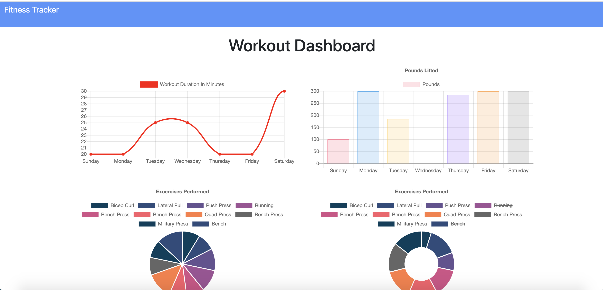

# Workout Tracker

## Description: 
  
  This project helps users reach their fitness goals by keeping track of their workouts.

## User Story
  
   As a user, I want to be able to view create and track daily workouts. I want to be able to log multiple exercises in a workout on a given day. I should also be able to track the name, type, weight, sets, reps, and duration of exercise. If the exercise is a cardio exercise, I should be able to track my distance traveled.

   ## Table of Contents:
  * [Installation](#installation)
  * [Usage](#usage)
  * [License](#license)
 
  
  ## Installation 
  To use, install the following package: npm install

  ## Usage
  View the deployed app at 
  To run locallly, use the following command: node server.js

  ## License

   

  This was created by CateDunn. Check out the project at https://github.com/CateDunn/Workout-Tracker. You can contact me at catedunn@alumni.unc.edu.